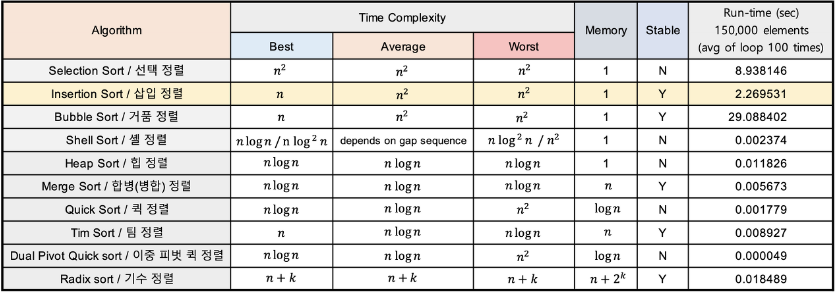

# 기본 정렬 알고리즘



# 삽입정렬

> 자료를 뒤에서 하나씩 삽입하면서 정렬한다고 생각

- 두번째 자료부터 시작하여 그 앞의 자료들과 비교하여 삽입할 위치를 지정한 후 자료를 뒤로 옮기고 지정한 자리에 자료를 삽입하여 정렬한다.

[https://www.youtube.com/watch?v=8oJS1BMKE64&t=21s](https://www.youtube.com/watch?v=8oJS1BMKE64&t=21s)

```java
package Sorting;

import java.util.Arrays;

public class InsertionSort {
    public static void insertion_sort(int [] a)
    {
        for(int i=1; i<a.length; i++)
        {
            int target = a[i];
            int j = i-1;

            while(j>=0 && target < a[j])
            {
                a[j+1] = a[j];
                j--;
            }
            /*
            위 반복문에서 탈츨하는 경우 앞의 원소가 타겟보다 작다는 의미이기 때문에
            타겟 원소는 j번째 원소 뒤에 와야한다.
             */
            a[j+1] = target;
        }
    }
}

강수 , 60
강호, 60
```

## 시간복잡도

정렬되어있는 경우 : O(N)

역순인 경우(최악) : O(N^2)

## 장점

- 추가적인 메모리 소비가 적다.
- 거의 정렬된 경우 매우 효율적이다. → O(N)
- 안정정렬이다.

## 단점

- 역순에 가까울수록 매우 비효율적. 즉, 최악의 경우 O(N^2)의 시간복잡도를 갖는다.
- 데이터의 상태에 따라서 성능 편차가 매우 크다.

# 선택정렬

> 현재 위치에 들어갈 데이터를 찾아 선택하는 알고리즘이다.

## 과정

1. 주어진 리스트에서 최솟값을 찾는다.
2. 최솟값을 맨 앞 자리의 값과 교환한다.
3. 맨 앞 자리를 제외한 나머지 값들 중 최솟값을 찾아 위와 같은 방법으로 반복한다.

[https://www.youtube.com/watch?v=92BfuxHn2XE](https://www.youtube.com/watch?v=92BfuxHn2XE)

```java
package Sorting;

import java.util.Arrays;

public class SelectionSort {
    public static void selection_sort(int [] a)
    {
        for(int i=0; i<a.length-1; i++)
        {
            int min_index = i;
            for(int j=i; j<a.length; j++)
            {
                if(a[min_index] > a[j])
                {
                    min_index = j;
                }
            }
            int tmp = a[i];
            a[i] = a[min_index];
            a[min_index] = tmp;
        }
    }
}
```

## 장점

- 추가적인 메모리 소비가 적다.

## 단점

- 시간복잡도가 O(N^2)

- 안정 정렬이 아니다.

  → 정렬 규칙이 다수이거나 특정 순서를 유지해야할때 문제가 될 수 있음

# 거품정렬

> 두개의 인접한 원소를 비교하여 정렬하는 방식
> 거품이 수면위로 올라오는 것 같다고 해서 붙었다고…

## 과정

1. 앞에서부터 현재 원소와 다음 원소를 비교한다.
2. 현재 원소가 다음 원소보다 크면 원소를 교환한다.
3. 다음 원소로 이동하여 해당 원소와 그 다음원소를 비교한다.

[https://www.youtube.com/watch?v=Cq7SMsQBEUw](https://www.youtube.com/watch?v=Cq7SMsQBEUw)

```java
package Sorting;

import java.util.Arrays;

public class BubbleSort {
    public static void bubble_sort(int [] a)
    {
        // 배열크기 - 1 만큼 진행됨
        for(int i=1; i<a.length; i++)
        {
            // 각 라운드별 비교횟수는 배열 크기의 현재 라운드를 뺀만큼 비교함
            for(int j=0; j<a.length-i; j++)
            {
                /*
                현재 원소가 다음 원소보다 클 경우
                서로 원소의 위치를 교환한다.
                 */
                if(a[j+1] < a[j])
                {
                    int tmp = a[j+1];
                    a[j+1] = a[j];
                    a[j] = tmp;
                }
            }
        }
    }
}
```

## 장점

- 추가적인 메모리 소비가 적다.
- 구현이 매우 쉽다.
- 안정정렬이 가능하다.

## 단점

- 다른 정렬 알고리즘에 비해 교환 과정이 많아 많은 시간을 소비한다.
  - 효율성 떨어짐 → 쓰이지 않는다.
  - O(N^2)

하지만, O(N)으로 만들 수 있는 방법이 있다.

→ swap을 더이상 안하면 이미 정렬되어있다는 의미니깐 반복문을 종료한다.

```java
package Sorting;

import java.util.Arrays;

public class BubbleSort {
    public static void bubble_sort(int [] a)
    {
        // 배열크기 - 1 만큼 진행됨
        for(int i=1; i<a.length; i++)
        {
            boolean flag = false;
            // 각 라운드별 비교횟수는 배열 크기의 현재 라운드를 뺀만큼 비교함
            for(int j=0; j<a.length-i; j++)
            {
                /*
                현재 원소가 다음 원소보다 클 경우
                서로 원소의 위치를 교환한다.
                 */
                if(a[j+1] < a[j])
                {
                    int tmp = a[j+1];
                    a[j+1] = a[j];
                    a[j] = tmp;
                    flag = true;
                }
            }

            /*
            swap 된적이 없다면 이미 정렬된거임 -> 반복문 종료
             */
            if(!flag) break;
        }
    }
}

```

삽입, 선택정렬처럼 O(N^2)의 시간복잡도를 갖지만

거품정렬의 교환횟수가 평균적으로 더 많아서 더 많은 시간이 걸린다.

# 합병 정렬

> 문제를 분할하고, 분할한 문제를 정복하여 합치는 과정
> ⇒ Divide and Conquer 기반

## 과정

1. 주어진 리스트를 절반으로 분할하여 부분리스트로 나눈다. (Divide : 분할)
2. 해당 부분리스트의 길이가 1이 아니라면 1번 과정을 되풀이한다.
3. 인접한 부분리스트끼리 정렬하여 합친다. (Conquer : 정복)


> 반드시 2개의 부분리스트로 나누어야 되는건 아니다. 일반적으로 절반으로 나누는거일뿐

[https://www.youtube.com/watch?v=ZRPoEKHXTJg&t=33s](https://www.youtube.com/watch?v=ZRPoEKHXTJg&t=33s)

```java
package Sorting;

import java.util.Arrays;

public class MergeSort {
    private static int []sorted; // 합치는 과정에서 정렬하여 원소 담는 배열

    //Top-Down 방식
    public static void merge_sort1(int[] a, int left, int right)
    {
        if(left==right) return;

        int mid = (left + right) / 2; // 절반 위치

				merge_sort1(a, left, mid);
				merge_sort1(a, mid+1, right);
				
				merge(a, left, mid, right);
    }
		//Bottom-UP 방식
		public static void merge_sort2(int []a, int left, int right)
    {
        // 나누는 size 크기로 반복
        for(int size = 1; size <= right; size += size)
        {
            /*
            두 부분리스트 순서대로 병합
             */
            for(int l=0; l<=right - size; l+=(2*size))
            {
                int low = l;
                int mid = l + size - 1;
                // high가 배열의 인덱스를 넘어갈 수 있으니깐 right, 1+(2*size)-1 중에 작은거
                int high = Math.min(l+(2*size)-1, right);
                merge(a, low, mid, high);
            }
        }
    }

    public static void merge(int [] a, int left, int mid, int right)
    {
        int l = left; // 왼쪽 부분리스트 시작점
        int r = mid + 1; // 오른쪽 부분리스트 시작점
        int idx = left; // 채워넣을 배열의 인덱스

        while(l<=mid && r<=right)
        {
            if(a[l] <= a[r])
            {
								sorted[idx] = a[l];
                l++;
                idx++;
            }
            else{
								sorted[idx] = a[r];
                r++;
                idx++;
            }
        }

        /*
        왼쪽 부분리스트가 먼저 새 배열에 채워졌을 경우 (l>mid)
        = 오른쪽 부분리스트 원소가 아직 남아있음
        오른쪽 부분리스트의 나머지 원소들을 새 배열에 채워준다.
         */
        if(l>mid)
        {
            while(r<=right){
								sorted[idx] = a[r];
                idx++;
                r++;
            }
        }
        /*
        오른쪽 부분리스트가 먼저 새 배열에 채워졌을 경우
        = 왼쪽 부분리스트 원소가 아직 남아있음
        왼쪽 부분리스트의 나머지 원소들을 새 배열에 채워준다.
         */
        else {
            while(l<=mid)
            {
								sorted[idx] = a[l];
                idx++;
                l++;
            }
        }

        // 정렬된 새 배열 기존 배열에 옮기기
        for(int i=left; i<=right; i++)
        {
            a[i] =sorted[i];
        }
    }
}

```

## 장점

- 항상 두 부분리스트로 쪼개서 들어가기 때문에 최악의 경우에도 O(NlogN)이 유지
- 안정정렬이다.

## 단점

- 정렬과정에서 추가적인 보조 배열공간 사용.(sorted[]) 메모리 사용량 많음
- 보조 배열에서 원본 배열로 복사하는 과정은 매우 많은 시간을 소비하기 때문에 데이터가 많은 경우 상대적으로 시간이 많이 소요

# 퀵 정렬

> 하나의 리스트를 pivot을 기준으로 두개의 부분리스트로 나누어 하나는 pivot보다 작은 값들의 부분리스트, 다른 하나는 pivot보다 큰 값들의 부분리스트로 정렬
> 각 부분리스트에 대해 다시 재귀적으로 수행
> → 분할정복 기반

### 병합정렬 vs 퀵정렬의 차이점

- 병합정렬 : 하나의 리스트를 ‘절반’으로 나누어 분할정복
- 퀵정렬 : 피벗의 값에 따라 나눈다. 따라서 하나의 리스트에 대해 비균등하게 나뉜다.
- 일반적으로 병합정렬보다 퀵정렬이 빠르다.

## 과정

1. 피벗을 하나 선택
2. 피벗을 기준으로 양쪽에서 피벗보다 큰 값, 혹은 작은 값을 찾는다
3. 양방향에서 찾은 두원소를 교환한다.
4. 왼쪽에서 탐색하는 위치와 오른쪽에서 탐색하는 위치가 서로 엇갈리지 않을때까지 2번으로 돌아가 위 과정을 반복한다.
5. 엇갈린 기점을 기준으로 두 개의 부분리스트로 나누어 1번으로 돌아가 해당 부분리스트의 길이가 1이 아닐때까지 1번 과정을 반복한다. (Divide : 분할)
6. 인접한 부분리스트끼리 합친다. (Conquer : 정복)

> 피벗을 정하는 방법은 가장 왼쪽 원소가 피벗, 중간원소가 피벗, 마지막 원소가 피벗

- Hoare 방식 : 왼쪽에서는 피벗보다 큰 값을 찾고, 오른쪽에서는 피벗보다 작은 값을 찾아 두 원소를 교환하는 방식
- Partitioning : 피벗보다 작은 값들은 왼쪽에, 큰값들은 오른쪽에 치중하도록 하는 것

[https://www.youtube.com/watch?v=8hEyhs3OV1w](https://www.youtube.com/watch?v=8hEyhs3OV1w)

```java
package Sorting;

public class QuickSort {
    public static void quick_sort(int[] a, int left, int right)
    {
        if(left >= right) return;

        /*
         * 피벗을 기준으로 요소들이 왼쪽과 오른쪽으로 약하게 정렬 된 상태로
         * 만들어 준 뒤, 최종적으로 pivot의 위치를 얻는다.
         *
         * 그리고나서 해당 피벗을 기준으로 왼쪽 부분리스트와 오른쪽 부분리스트로 나누어
         * 분할 정복을 해준다.
         *
         * [과정]
         *
         * Partitioning:
         *
         *   a[left]          left part              right part
         * +---------------------------------------------------------+
         * |  pivot  |    element <= pivot    |    element > pivot   |
         * +---------------------------------------------------------+
         *
         *
         *  result After Partitioning:
         *
         *         left part          a[lo]          right part
         * +---------------------------------------------------------+
         * |   element <= pivot    |  pivot  |    element > pivot    |
         * +---------------------------------------------------------+
         *
         *
         *  result : pivot = lo
         *
         *
         *  Recursion:
         *
         * l_pivot_sort(a, lo, pivot - 1)     l_pivot_sort(a, pivot + 1, hi)
         *
         *         left part                           right part
         * +-----------------------+             +-----------------------+
         * |   element <= pivot    |    pivot    |    element > pivot    |
         * +-----------------------+             +-----------------------+
         * lo                pivot - 1        pivot + 1                 hi
         *
         */

        int pivot = partition(a, left, right);
        quick_sort(a, left, pivot-1);
        quick_sort(a, pivot+1, right);
    }

    // pivot을 기준으로 파티션을 나누기 위한 약한 정렬 메소드
    public static int partition(int [] a, int left, int right)
    {
        int low = left;
        int high = right;
        int pivot = a[left]; // 왼쪽요소를 피벗으로 설정

        // low 가 high 보다 작을때까지 반복
        while(low < high)
        {
            /*
            high가 low보다 크면서, high의 요소가 pivot보다 작거나 같은 원소를 찾을때까지
            high를 감소시킨다.
             */
            while(a[high] > pivot && low < high)
                high--;

            /*
            high가 low보다 크면서, low의 원소가 pivot보다 큰 원소를 찾을때까지
            low를 증가
             */
            while(a[low] <= pivot && low < high)
                low++;

            swap(a,low, high);
        }

        swap(a,left, low);

        // 이제 pivot이 low에 위치
        return low;
    }

    private static void swap(int[] a, int i, int j)
    {
        int temp = a[i];
        a[i] = a[j];
        a[j] = temp;
    }
}
```

## 장점

- 특정 상태가 아닌 이상 평균 시간 복잡도는 NlogN이며, 다른 NlogN 알고리즘에 비해 대체적으로 속도가 매우 빠름. 유사하게 NlogN 정렬 알고리즘 중 분할 정복 방식인 merge sort에 비해 2~3배 빠름
- 추가적인 별도의 메모리를 필요로하지 않으며 재귀 호출 스택프레임에 의한 공간복잡도는 logN으로 메모리를 적게 소비

## 단점

- 특정 조건하에 성능이 급격하게 떨어진다. → 정렬되어있는 경우
- 재귀를 사용하기 때문에 재귀를 사용하지 못하는 환경일 경우 구현이 매우 복잡해짐
