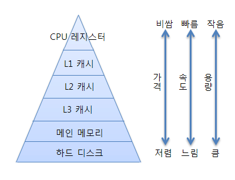

# 메모리

> 메인 메모리는 CPU가 직접 접근할 수 있는 기억장치
> 프로세스가 실행되려면 프로그램이 메모리에 올라와야함

# 메모리 계층구조 = 기억장치 계층

[참고](https://velog.io/@steadygo247/%EB%A9%94%EB%AA%A8%EB%A6%AC-%EA%B3%84%EC%B8%B5%EA%B5%AC%EC%A1%B0)

- 메모리를 필요에 따라 CPU가 메모리에 더 빨리 접근하기 위해서 여러가지 종류로 나눔

- 레지스터와 캐시는 CPU 내부에 존재. 
  당연히 CPU는 아주 빠르게 접근가능
- 메모리는 CPU 외부에 존재. 
  레지스터와 캐시보다 느림
- 하드디스크는 CPU가 접근할 방법이 없음. 
  CPU가 하드디스크에 접근하기 위해서는 하드디스크의 데이터를 메모리로 이동시키고, 메모리에서 접근해야됨. 아주 느린 접근 밖에 불가능

## 메모리 계층구조의 목적

- 입출력의 경제성 확보 ⇒ 기억장치를 구성하면서 가격은 최소화하고 가능한 빠른 접근 속도와 대용량의 크기를 제공하기 위해
- 메모리 구조에서 상층에 속할수록 더 비쌈. 비싼 하드웨어는 꼭 필요한 만큼의 크기만 사용하고, 싼 하드웨어를 넉넉한 크기만큼 사용

## 메모리(기억장치)의 특징

### 지역성

- 시간적 지역성 : 특정 데이터가 한번 접근되었을 경우, 가까운 미래에 또 한번 데이터에 접근할 가능성이 높아짐
- 공간적 지역성 : 접근한 기억장소와 인접한 기억장소가 접근 될 가능성이 높음

⇒ 지역성의 원리를 이용하여 계층으로 구성된다.

⇒ 계층적으로 메모리를 두었을 때 성능이 좋아진다.

## 메모리 계층구조 장치

### CPU

> Central Processing Unit. 중앙처리장치

- 컴퓨터의 4대 주요기능(기억, 해석, 연산, 제어)을 관할하는 장치
- CPU는 자체적으로 데이터를 저장할 방법이 없으므로 메모리로 직접 데이터를 전송할 수 없음

→ 연산을 위해서 레지스터를 거쳐야 함. 이를 위해 레지스터는 특정 주소를 가리키거나 값을 읽어올 수 있음

### 레지스터

- CPU 내에서 데이터를 기억하는 메모리 장치
- 일시적(휘발성)으로 기억함. 메모리 장치 중 속도가 가장 빠름
- 데이터 저장, 명령어저장, 연산 수행, 주소 지정, 상태저장의 역할을 한다.

**레지스터의 종류**

| 종류                                               | 설명                                                         |
| -------------------------------------------------- | ------------------------------------------------------------ |
| 프로그램 계수기(PC, Program Counter)               | 다음에 실행할 명령어(instruction)의 주소를 가지고 있는 레지스터 |
| 누산기(AC, ACcumulator)                            | 연산 결과 데이터를 일시적으로 저장하는 레지스터              |
| 명령어 레지스터(IR, Instruction Register)          | 현재 수행 중인 명령어를 가지고 있는 레지스터                 |
| 상태 레지스터(SR, Status Register)                 | 현재 CPU의 상태를 가지고 있는 레지스터                       |
| 메모리 주소 레지스터(MAR, Memory Address Register) | 메모리로부터 읽어오거나 메모리에 쓰기 위한 주소를 가지고 있는 레지스터 |
| 메모리 버퍼 레지스터(MBR, Memory Buffer Register)  | 메모리로부터 읽어온 데이터 또는메모리에 써야 할 데이터를 가지고 있는 레지스터 |
| 입출력 주소 레지스터(I/O AR, I/O Address Register) | 입출력 장치에 따른 입출력 모듈의 주소를가지고 있는 레지스터  |
| 입출력 버퍼 레지스터(I/O BR, I/O Buffer Register)  | 입출력 모듈과 프로세서 간의 데이터 교환을 위해 사용되는 레지스터 |

## 캐시

지역성을 이용해서 다시 사용될 확률이 높은 것은 캐시에 저장함

### 캐시의 목적

- CPU와 메인 메모리 간의 속도 차이 개선을 목적으로 한다. → 즉, CPU 성능 향상
- CPU의 성능이 발전하고 데이터 요청 속도가 빨라지면서 메인메모리에서 레지스터로 옮기는 시간을 줄이고자 했다. 그래서 CPU내에 위치한 캐시 메모리를 만들어서 자주 사용하는 데이터를 저장해 속도를 개선시키고자 했다.

### **캐시의 계층구조**

보통 L1, L2, L3로 나뉘며 L1부터 CPU에 가깝게 배치된다. 

- L1, L2는 각 CPU 코어마다 가지고 있는 캐시

- L3는 모든 코어가 공유하는 캐시

- 1레벨부터 접근하여 없으면 밑으로 내려감

  

  

### 캐시를 언제 사용하면 좋을까?

1. 단순한 데이터
2. 동일한 데이터를 반복적으로 제공해야하는 경우
3. 데이터의 변경주기가 빈번하지 않고, 단위처리시간이 오래걸리는 경우
4. 데이터의 최신화가 반드시 실시간으로 이루어지지 않아도 서비스 품질에 영향을 거의 주지 않는 데이터

<aside>
💡 캐시를 사용하면 서버간 불필요한 트래픽을 줄일 수 있다.
웹 애플리케이션 서버의 부하가 감소된다.
캐시에 저장된 데이터를 빠르게 읽어와 애플리케이션을 사용하는 고객에게 빠른 서비스 경험 제공 가능

</aside>

## 메인 메모리(주기억장치)

> 컴퓨터 시스템에서 데이터와 프로그램을 저장하고 관리하는 장치
> 컴퓨터는 데이터를 처리하고 프로그램을 실행할때 메모리를 사용하여 필요한 정보를 읽고 쓰며 작업을 수행한다. 메모리는 정보를 임시로 저장하고 효율적으로 액세스 할 수 있도록 하는 중요한 구성요소

### 주기억 장치의 구성

- RAM : 휘발성 기억 장치 → 전원이 꺼지면 기억된 내용이 모두 사라지는 메모리
  - CPU의 빠른 접근을 위한 각종 정보를 임시 저장하는 휘발성 장치이다.
  - 사용자가 요청하는 프로그램이나 문서를 스토리지 디스크에서 메모리로 로드하여 각각의 정보에 액세스
  - 전원이 유지되는 동안 CPU의 연산 및 동작에 필요한 모든 내용이 저장
  - 전원 종료시 기억된 내용 삭제
  - Random Access : 어느 위치에서든 똑같은 속도로 접근하여 읽고 쓸 수 있음
  - HDD에 비해 월등히 빠른 속도로 CPU가 정보를 원할히 이용할 수 있도록 한다.
- ROM (Read Only Memory) : 고정 기억 장치
  - 컴퓨터에 지시사항을 영구히 저장하는 비휘발성 메모리 → 전원이 실제로 꺼져도 기억된 내용이 지워지지않는 메모리
  - 전원 종료시 기억된 내용 유지
  - 변경 가능성이 희박한 기능 및 부품에 사용
    - 소프트웨어 : 초기 부팅 관련 부분
    - 하드웨어 : 프린터 작동에 관여하는 펌웨어 명령 등
  - ROM은 주기억장치로 사용되기보다는 주로 기본 입,출력 시스템 (BIOS), 자가진단프로그램(POST)같은 변경 가능성이 희박한 시스템 소프트웨어를 기억시키는데 이용한다.

### RAM을 주기억장치라고 표현하는 이유

RAM과 CPU는 데이터를 주고받으며 프로그램을 구동하기 때문이다.

과정

1. 보조기억장치에서 주기억장치로 프로그램을 불러온다.(부팅 또는 로딩)
2. 주기억장치에서 프로그램을 기억하고 CPU와 통신할 준비를 한다. (동작 및 구동)
3. 주기억장치와 CPU에서 데이터를 주고받으며 프로그램을 구동한다. (동작 및 구동)

## 보조기억장치

> 중앙처리장치(CPU)에서 요청이 오면 저장하고 있던 프로그램과 데이터를 주기억장치로 전송한다.
> 대표적인 보조기억장치로 하드디스크, SSD, USB 메모리, 광디스크가 있다.

- 하드 디스크, 하드 드라이브, 고정디스크
- 비휘발성, 순차접근이 가능한 컴퓨터의 보조 기억장치

| 주 기억장치                                       | 보조 기억 장치                                           |
| ------------------------------------------------- | -------------------------------------------------------- |
| 접근속도가 빠르다.                                | 접근 속도가 느리다.                                      |
| 가격이 비싸다.                                    | 가격이 싸다.                                             |
| 저장용량이 적다.                                  | 저장용량이 크다.                                         |
| 대부분 전원공급이 중단되면 지워지는 휘발성 메모리 | 전원이 차단되어도 내용이 그래도 유지되는 비휘발성 메모리 |
| 오랜기간 보관할 수 없다.                          | 반영구적으로 저장할 수 있다.                             |

# 프로그램 실행 과정

## Java 프로그램 실행

### 컴파일 단계

1. 소스코드 작성 : 프로그래머가 Java 언어로 소스코드를 작성한다. 이 코드는 텍스트 파일로 디스크에 저장된다.
2. 컴파일러 사용 : Java 소스코드는 Java 컴파일러에 의해 컴파일된다. 이때 소스코드가 바이트 코드로 번역하여 .class 파일에 저장한다. 이 파일은 디스크에 저장된다.

### 실행 단계

1. 클래스 로더 : Java 프로그램을 실행하기 위해 JVM의 클래스로더가 .class파일을 메모리에 로드한다.
2. 런타임 데이터 영역 : 메모리에 런타임 데이터 영역이 할당된다.
3. 실행 : JVM이 메모리에 로드된 바이트 코드를 해석하고 실행한다.
   1. 바이트 코드를 해석하여 기계어 코드로 변환
   2. 프로그램 실행 중에 필요한 데이터(객체, 배열과 같은 동적변수)는 Heap에 할당. 메소드 호출 및 지역변수는 Stack에 저장

<aside>
💡 JVM (Java Virtual Machine)
Java 바이트 코드 → 기계어 변환
JVM은 Java 언어의 특성을 컴퓨터의 하드웨어에 독립적으로 보장해주는 역할을 한다.

⇒ Java 바이트 코드를 기계어로 변환하고, 해당 기계어를 실제 CPU에서 실행하여 프로그램을 수행한다.

</aside>

## 정리

프로그램 코드

1. CPU가 바로 해석할 수 있는 기계어의 형태로 번역되어 하드디스크에 저장
2. 운영체제에 의해서 실행될때 주기억장치에 올려진다.
3. CPU의 컨트롤 로직에 의해서 하나씩 실행

프로그램 실행될때 필요한 데이터

1. 하드디스크에 저장
2. 메모리를 통해서 레지스터에 저장된 후 연산에 사용

연산의 결과값

1. 레지스터에 저장
2. 메모리를 거쳐 하드디스크에 저장
